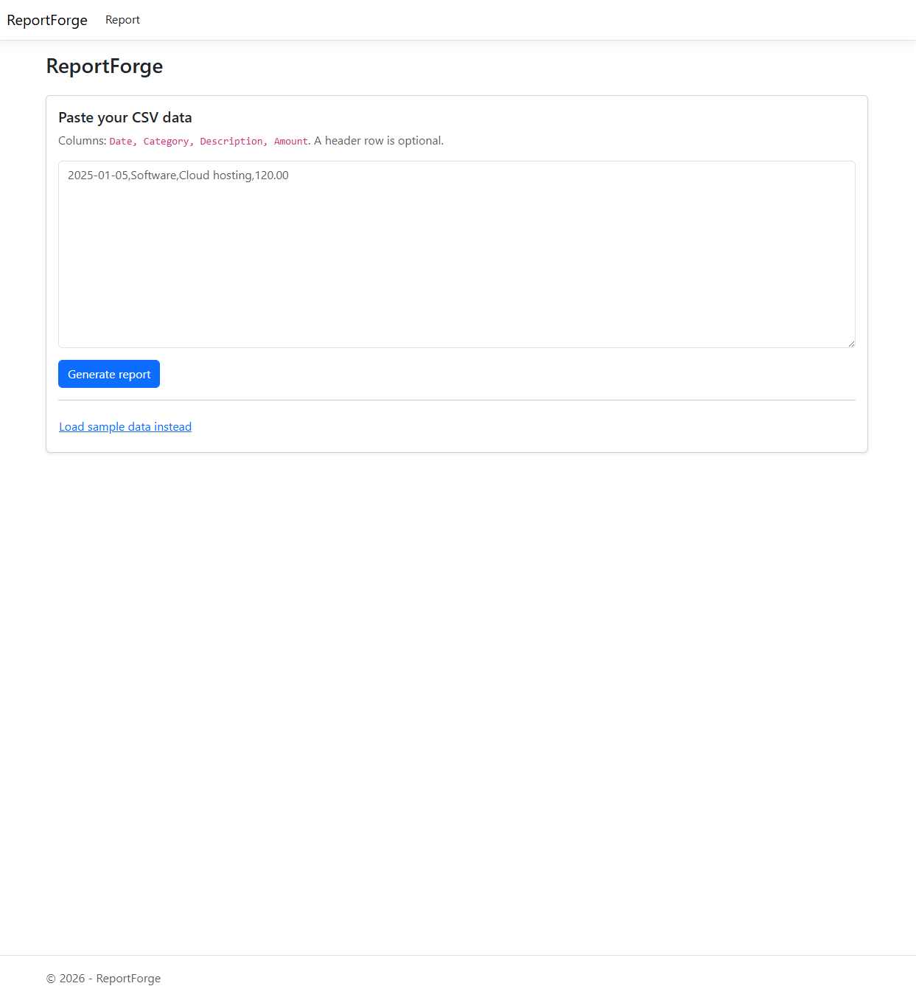
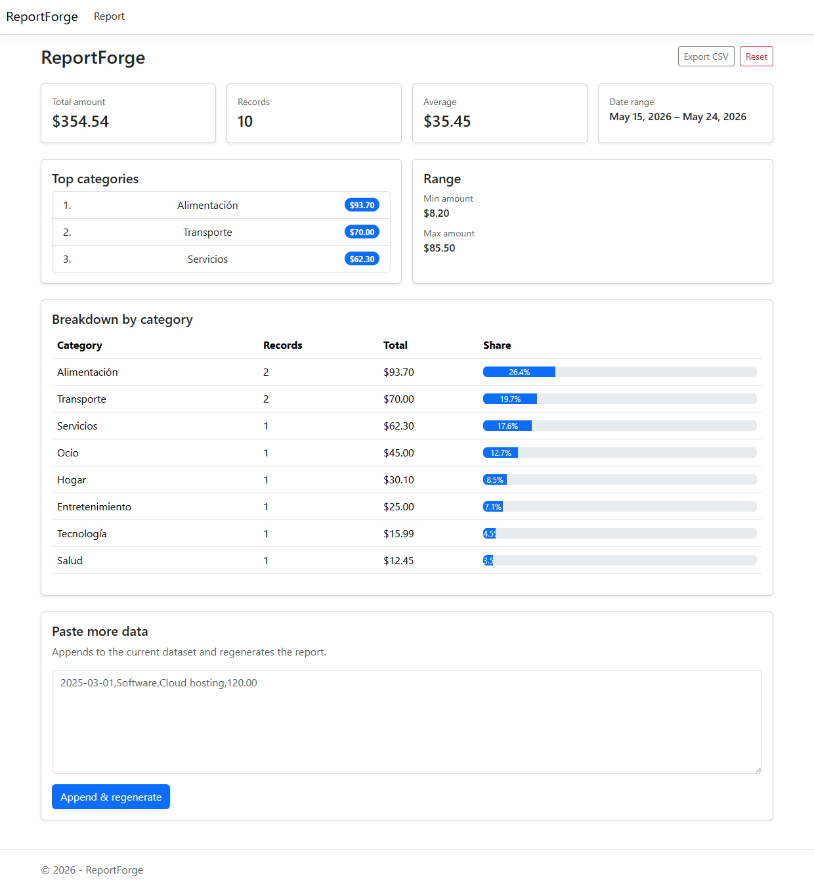

# ReportForge

ReportForge is a small ASP.NET Core MVC app that turns pasted CSV transaction data into an
instant business report — totals, category breakdown, top categories by spend, and date range —
computed by a layered, interface-driven backend with full unit test coverage.




## Architecture

Four projects plus a test project, with dependencies flowing in one direction only:

```
              ReportForge.Web
        (ASP.NET Core MVC — controllers,
         views, ViewModels, DI wiring)
             /                  \
            v                    v
ReportForge.Application   ReportForge.Infrastructure
   (ReportService)             (CsvDataParser)
            \                    /
             v                  v
              ReportForge.Domain
     (TransactionRecord, ReportResult,
    CategorySummary, IDataParser,
    IReportGenerator, DataParsingException)
```

- **Domain** has zero dependencies — just models, the two interfaces, and the shared exception
  type. It defines the contracts; it doesn't know who implements or calls them.
- **Application** (`ReportService`) and **Infrastructure** (`CsvDataParser`) both depend only on
  Domain, never on each other. Either could be replaced independently.
- **Web** composes everything at the DI root (`Program.cs`) and depends on `IDataParser` /
  `IReportGenerator` everywhere else — controllers never reference the concrete classes.

## Design decisions

- **Interfaces + constructor injection everywhere.** `ReportController` only ever sees
  `IDataParser` and `IReportGenerator`. Swapping `CsvDataParser` for a JSON importer, or
  `ReportService` for a different aggregation strategy, touches one line in `Program.cs` and
  nothing else.
- **Domain has no framework dependencies.** No ASP.NET Core, no serialization attributes — just
  plain C#. That's what makes it possible to unit test `ReportService` and `CsvDataParser` with
  zero mocking (no `HttpContext`, no running server).
- **Immutability by default.** `TransactionRecord`, `ReportResult`, and `CategorySummary` are
  `sealed record` types with `init`-only, `required` properties. A generated report can't be
  mutated after the fact, and value-based equality comes for free.
- **Explicit, typed error handling.** Malformed input raises a single `DataParsingException`
  (with the offending line number) from both the parser and the report service. The controller
  catches it once and turns it into a user-facing message — no silent failures, no generic 500s
  for a bad paste.
- **No database, by design.** The working dataset lives in the HTTP session as JSON. That keeps
  the scope honest for a portfolio piece while proving the point of the architecture: a real
  store could be dropped in behind `IDataParser`'s callers without changing `ReportService` or
  the controller.
- **ViewModels are not domain models.** `ReportViewModel` / `CategorySummaryViewModel` add
  display-only concerns (like `PercentageOfTotal` for the breakdown bars) and are mapped from
  `ReportResult` in the controller, keeping presentation shaping out of the Domain/Application
  layers.

## Tech stack

- **.NET 10**, latest C# language version
- **ASP.NET Core MVC** (Razor views)
- **Bootstrap 5** (bundled locally, no CDN)
- **xUnit** (17 tests across parsing and report aggregation)
- **No database** — HTTP session (JSON-serialized) holds the working dataset

## How to run

```bash
dotnet restore
dotnet run --project src/ReportForge.Web
dotnet test
```

The app opens on `https://localhost:7278` (or `http://localhost:5085`). Click **Load sample data**
for an instant demo, or paste your own CSV (`Date,Category,Description,Amount`, header row
optional).

## 日本語概要

ReportForge は、貼り付けた CSV 形式の取引データから合計金額・カテゴリ別内訳・上位カテゴリ・
期間などをまとめたビジネスレポートを即座に生成する ASP.NET Core MVC アプリケーションです。
ドメイン駆動の層構造と依存性逆転（インターフェース経由の依存）を徹底し、C# / .NET の基礎力と
保守しやすい設計を示すポートフォリオ作品として作成しました。
